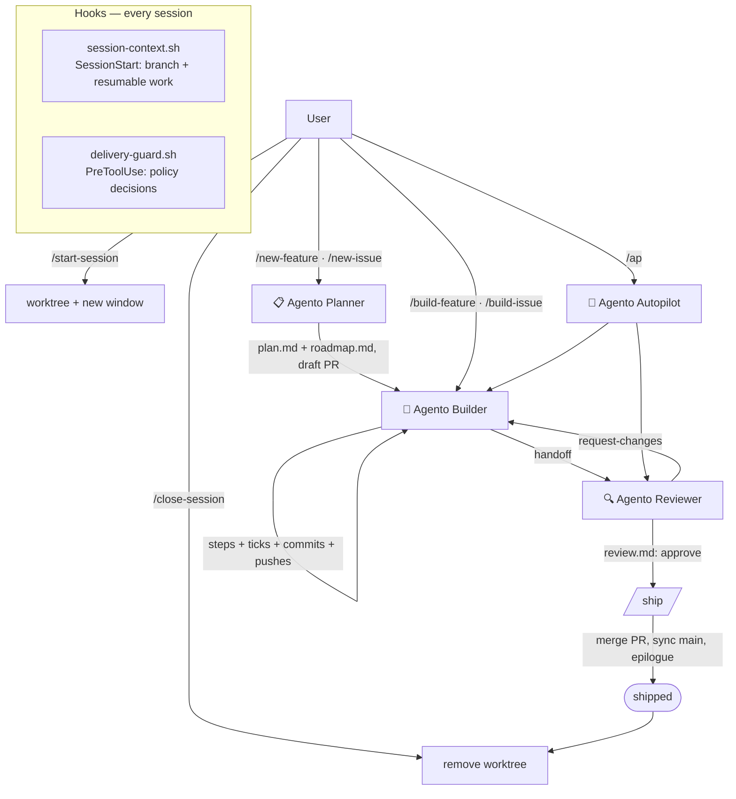

# Architecture

## Pieces

- **Prompts** (`.github/prompts/`) are the slash commands. They are thin: they set
  expectations and dispatch to an agent.
- **Agents** (`.github/agents/`) hold the durable behavior: resume protocol, work
  loop, verification gates, review scoring, autopilot orchestration, and the
  mechanic that maintains the system itself.
- **Instructions** (`.github/instructions/`) are always-on contracts. The
  **delivery policy** (`delivery-policy.instructions.md`, `applyTo: "**"`) is the
  single source for the rules every role shares — who does the work, verification
  targets, manual/post-ship steps and evidence, the lint gate, shell hygiene, git
  rules, the cross-window handoff; agents and prompts cite its numbered sections
  (`§2`) instead of restating them, and a test fails if a rule is spelled out twice.
  The **artifact contract** holds only formats; **concurrent-delivery** holds only
  mechanics (ports, previews, shared resources, integration recipes); **ai-skills**
  is the skills-first policy.
- **Hooks** run outside the model. `session-context.sh` injects branch, resumable
  work, and the Agento CLI path at session start; `delivery-guard.sh` can
  `allow`/`ask`/`deny` any tool call (default-branch protection, force-push and hook
  bypasses, open-ended watchers, ruleset-bypassing merges, hook self-protection,
  worktree-occupant detection). The guard is a slip guard for the model, not an
  enforcement boundary — that is the GitHub ruleset on the default branch.
- **Scripts** are the deterministic helpers, fronted by `scripts/agento.mjs`: the
  config loader, the roadmap resolver (local search with origin fallback and
  branch-header validation), the status lister, worktree path and per-slug port
  derivation, the bounded CI poller, and the guard replay harness. Prompts call the
  CLI rather than re-deriving these algorithms in prose, so the configured branch
  names and artifact roots are honoured everywhere the hooks honour them.

## Where state lives

The only durable progress record is the committed, pushed `roadmap.md` in the
**target repository** — never chat, never the plugin, never local files. Any machine
can resume any session from git state alone. The Agento clone itself holds no
per-project state.

## Configuration boundary

| Project-specific fact | Where it lives |
|---|---|
| Artifact roots, worktree dir, branch names, release workflow | target repo `.github/agento.json` (read by hooks, the resolver, and `scripts/agento.mjs`) |
| Commands, verification strategy, shared resources, skills table | target repo `AGENTS.md` `## Agento` section (read by agents) |
| Delivery policy and artifact format | the plugin (this repo) |

Where prompt text still says `main`, `features/`, or `issues/`, read it as the
configured `branches.default`, `artifacts.features`, and `artifacts.issues`; the
values the model should actually use come from `agento.mjs config`.
