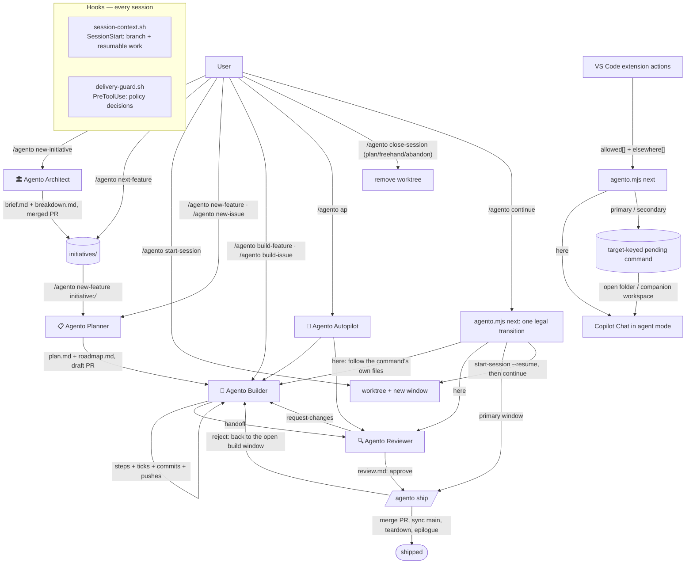

# Architecture

## Pieces

- **Prompts** (`.github/prompts/`) are the slash commands. They are thin: they set
  expectations and dispatch to an agent.
- **Agents** (`.github/agents/`) hold the durable behavior: the Architect's brief
  decomposition and self-contained publish, the Planner's resume protocol and
  dependency-gated initiative intake, the Builder's work loop and verification
  gates, review scoring, autopilot orchestration, and the mechanic that maintains
  the system itself.
- **Instructions** (`.github/instructions/`) are always-on contracts. The
  **delivery policy** (`delivery-policy.instructions.md`, `applyTo: "**"`) is the
  single source for the rules every role shares — who does the work, verification
  targets, manual/post-ship steps and evidence, the lint gate, shell hygiene, git
  rules, the cross-window handoff, and execution receipts with per-command
  idempotency (every command opens with a receipt line carrying a deterministic
  operation ID and closes with a result line; a duplicate submission resumes from git
  + roadmap state), capability preflight (§10: every command and agent declares
  `Needs:`/`Fallback:`; `agento.mjs doctor --for <name>` runs before the first write
  of any command needing `gh`, `code`, or `network`), and the window check (§11: every
  command names the `role` it requires and checks it against `agento.mjs session` — a
  mismatch is a `rejected` receipt with the record's alternatives; the roles table
  itself lives in the CLI), and command presentation (§12: every `/agento …`
  command a response asks the user to run is emitted as its own one-command fenced
  block with no language tag, giving it a copy button in chat); agents and prompts
  cite its numbered sections
  (`§2`) instead of restating them, and a test fails if a rule is spelled out twice.
  The **artifact contract** holds only formats; **concurrent-delivery** holds only
  mechanics (ports, previews, shared resources, integration recipes); **ai-skills**
  is the skills-first policy; **command-invocation** is the canonical spelling and
  redirect rule for slash commands (`/agento <name>`; old forms are read as the
  canonical command and proceed without confirmation).
- **Hooks** run outside the model. `session-context.sh` injects branch, resumable
  work, and the Agento CLI path at session start; `delivery-guard.sh` can
  `allow`/`ask`/`deny` any tool call (default-branch protection, force-push and hook
  bypasses, open-ended watchers, ruleset-bypassing merges, hook self-protection,
  worktree-occupant detection). The guard is a slip guard for the model, not an
  enforcement boundary — that is the GitHub ruleset on the default branch.
- **Scripts** are the deterministic helpers, fronted by `scripts/agento.mjs`: the
  config loader, the roadmap resolver (local search with origin fallback and
  branch-header validation), the status lister, the initiative deriver (per-member
  state, `blockedBy`, waves, and `next` computed from member roadmaps — the
  breakdown itself holds no progress), worktree path and per-slug port
  derivation, the bounded CI poller, and the guard replay harness. Prompts call the
  CLI rather than re-deriving these algorithms in prose, so the configured branch
  names and artifact roots are honoured everywhere the hooks honour them.
- **Extension** (`extension/`) renders CLI state and dispatches only the command
  records supplied by `allowed[]` and `elsewhere[]`. It revalidates delivery actions
  through `agento.mjs next <slug>`; same-window routes open Copilot Chat with the
  canonical query in agent mode. Cross-window routes persist `/agento continue
  <slug>` under the exact CLI target, prefer the generated `.code-workspace` for a
  companion pair, and open the target window. That window atomically consumes the
  record on activation or focus before submission. Records expire after five
  minutes; invalid, mismatched, or failed handoffs are surfaced without submission.
  The extension can focus another window but cannot read or cancel that window's
  chat through the public VS Code API.

## Extension acceptance boundary

The extension acceptance suite generates fresh Git repositories for both supported
artifact layouts on every run. The in-repo scenario writes delivery and initiative
artifacts into the product fixture; the companion scenario creates and initializes a
separate artifact repository and points the product configuration at it. CLI state,
pull requests, lifecycle progress, warnings, doctor checks, worktree ownership, and
companion synchronization are deterministic inputs. Each scenario and isolated
profile is removed after its test, and the harness asserts cleanup.

Electron acceptance activates the contributed extension and drives its registered
commands. It inspects the Deliveries, Initiatives, and Session & Doctor providers and
the status bar, then verifies exact canonical command text and CLI-selected targets
at the dispatch boundary. It does not run an Agento agent or inspect Copilot Chat
output; those are outside VS Code's public extension API.

Packaging has a separate installed-artifact gate. `npm run package` validates the
VSIX archive, and `npm run test:vsix` installs that VSIX into temporary user-data and
extensions directories with the pinned VS Code test runtime. The smoke launches the
installed extension against a generated Git fixture, verifies activation and the
expected command/view contributions, and removes the isolated profile.

User-facing installation and operation are documented in the
[VS Code extension guide](extension.md).

## Where state lives

The only durable progress record is the committed, pushed `roadmap.md` in the
**target repository** — never chat, never the plugin, never local files. Any machine
can resume any session from git state alone. The Agento clone itself holds no
per-project state.

## Configuration boundary

| Project-specific fact | Where it lives |
|---|---|
| Artifact roots, worktree dir, branch names, release workflow | target repo `.github/agento.json` (read by hooks, the resolver, and `scripts/agento.mjs`) |
| Delivery artifacts themselves (`features/`, `issues/`, `initiatives/`) | the target repo, or — when `artifacts.repo` names a sibling companion checkout — that checkout, which the CLI resolves as `artifactsRoot` against the primary checkout and `doctor` verifies (`artifact-repo`); each managed session then owns a companion half under the derived `<artifacts.repo.dir>-worktrees/<kind>-<id>` next to its product half |
| Commands, verification strategy, shared resources, skills table | target repo `AGENTS.md` `## Agento` section (read by agents) |
| Delivery policy and artifact format | the plugin (this repo) |

Where prompt text still says `main`, `features/`, `issues/`, or `initiatives/`, read
it as the configured `branches.default`, `artifacts.features`, `artifacts.issues`,
and `artifacts.initiatives`; the values the model should actually use come from
`agento.mjs config`.

**Companion-cwd anchoring.** The companion clone carries no `agento.json`, so a CLI
call whose cwd is inside the companion clone or one of its halves cannot read the
product config from its own toplevel. `agento.mjs` therefore anchors first: when the
cwd's toplevel has no `artifacts.repo` of its own, it takes that checkout's primary
(the first entry of its own `git worktree list --porcelain`), lists the primary's
parent directory once, and picks the sibling git checkout whose `.github/agento.json`
resolves `artifacts.repo.dir` to exactly that clone. Exactly one match → the record is
computed from that product (for a half `<kind>-<id>`, from the product half of the
same name when it exists) and `warnings[]` carries `anchored-from-companion`; zero
matches → today's behaviour (`unmanaged`); several → `unmanaged` plus a warning
listing them. The hooks pass `--root <cwd>` unchanged, so a terminal sitting in the
companion folder of a pair window prints the same `Session:` line as the product
folder.

**Layout rule — the checkout decides, the primary anchors.** Companion mode is on for
a checkout when *its own* `.github/agento.json` sets `artifacts.repo`; the companion
path always resolves against the primary checkout, and when the primary's config
also sets `artifacts.repo` the primary's values win. Own config unset → in-repo,
regardless of the primary (a worktree on a pre-companion branch keeps reading its own
roots). The CLI (`resolveArtifacts()`) and the Python `resolve_artifacts()` shared by
both hooks apply the same rule. On top of it, the slug-targeted readers (`resolve`,
`find`, `close-decision`, `ship-preflight`, `next <slug>`, `paths <feature|issue>
<slug>`) fall back to the **delivery branch's** config when an in-repo checkout finds
no roadmap: they read `origin/<branch>:.github/agento.json` (then `<branch>:…`) and,
when it names a companion that exists beside the primary, redo the read against that
clone and report `layout: "branch"` with `artifactsRoot` set to it. This is what lets
`/agento ship` run from a primary whose `main` is still in-repo while the migration
PR (`/agento agento-init --migrate`) is open; a branch naming an absent companion
stays `missing` — nothing is cloned implicitly.
